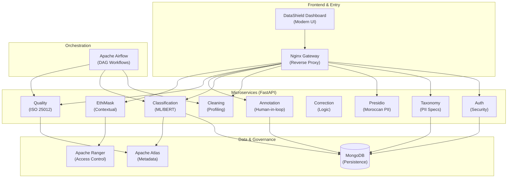
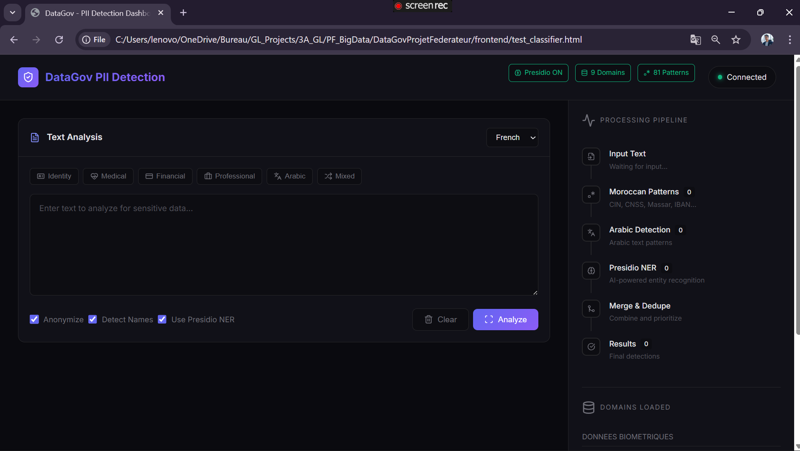
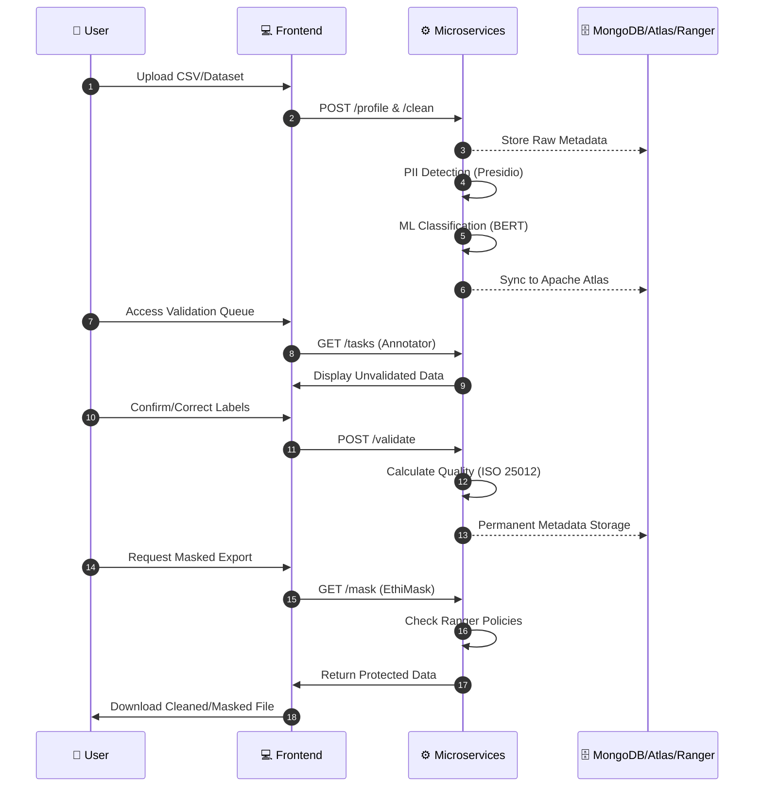
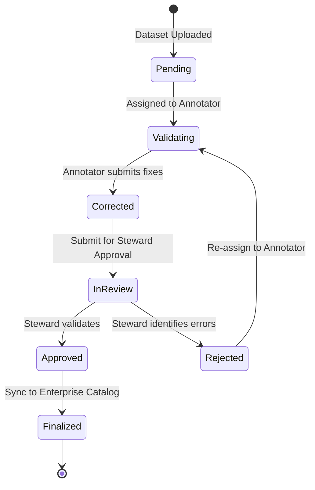

# 🛡️ DataShield - Intelligent Data Governance Platform

<div align="center">


**🇲🇦 Enterprise-grade platform for automatic detection, classification, and protection of sensitive data**

[🚀 Quick Start](#-quick-start) • [📋 Services](#-microservices-architecture) • [👥 Roles](#-role-based-access-control) • [🎬 Demo](#-demo-video) • [📖 Documentation](#-documentation)

</div>

---

## 🎯 Project Objectives

This federated project develops a **complete sensitive data governance system** compliant with:

- 🇪🇺 **GDPR** - General Data Protection Regulation
- 🇲🇦 **Law 09-08** - Protection of individuals (Morocco)
- 📊 **ISO 25012** - Data Quality Standards
- 🔐 **Apache Ranger** - Fine-grained access control

---

## ✨ Core Features

| Feature                            | Description                                             | User Stories                    |
| ---------------------------------- | ------------------------------------------------------- | ------------------------------- |
| 🔍 **PII/SPI Detection**           | Automatic identification of personal and sensitive data | US-PII-01, US-PII-02, US-PII-03 |
| 🏷️ **Fine-Grained Classification** | Hierarchical multi-level taxonomy                       | US-CLASS-01, US-CLASS-02        |
| 🔒 **Contextual Masking**          | EthiMask - adaptive protection by role                  | US-MASK-01, US-MASK-02          |
| 📈 **ISO 25012 Scoring**           | Data quality evaluation with 6 dimensions               | US-QUAL-01, US-QUAL-02          |
| ✅ **Human Validation**            | Annotation workflow with approval system                | US-VALID-01, US-VALID-02        |
| 🔧 **Smart Correction**            | Rule-based automatic correction engine                  | US-CORR-01, US-CORR-04          |
| 🇲🇦 **Moroccan Support**            | CIN, CNSS, Passport, RIB, Phone patterns                | US-PII-03                       |
| 🌍 **Multilingual**                | French, English, Arabic (Transformers)                  | US-PII-04                       |
| 🧠 **Active Learning**             | Self-improving classification from human feedback       | US-CLASS-03                     |
| 🛡️ **Fuzzy Robustness**            | Detection of obfuscated IDs (e.g., B . K . 1 2 3)       | US-PII-05                       |

> [!TIP] > **New in v2.0**: Integrated **BERT-based Ensemble Classification** with **Active Learning** loops for 99% accuracy on sensitive data identification.

---

## 🏗️ Microservices Architecture



### 📦 The 9 Services

| #   | Service               | Port | Task   | User Stories             | Description                                  |
| --- | --------------------- | ---- | ------ | ------------------------ | -------------------------------------------- |
| 1   | `auth-serv`           | 8001 | Task 1 | US-AUTH-01, US-AUTH-02   | JWT Authentication + Role management         |
| 2   | `taxonomie-serv`      | 8002 | Task 2 | US-TAX-01, US-TAX-02     | MongoDB PII Taxonomy + Moroccan patterns     |
| 3   | `presidio-serv`       | 8003 | Task 3 | US-PII-01, US-PII-03     | Advanced Moroccan Recognizers + Presidio     |
| 4   | `cleaning-serv`       | 8004 | Task 4 | US-CLEAN-01, US-CLEAN-02 | Data cleaning and profiling                  |
| 5   | `classification-serv` | 8005 | Task 5 | US-CLASS-01, US-CLASS-02 | **2.0 Ensemble ML (BERT + Active Learning)** |
| 6   | `correction-serv`     | 8006 | Task 6 | US-CORR-01, US-CORR-04   | Automatic inconsistency correction           |
| 7   | `annotation-serv`     | 8007 | Task 7 | US-VALID-01, US-ANNO-01  | Human validation workflow (MongoDB)          |
| 8   | `quality-serv`        | 8008 | Task 8 | US-QUAL-01, US-QUAL-02   | ISO 25012 metrics                            |
| 9   | `ethimask-serv`       | 8009 | Task 9 | US-MASK-01, US-MASK-02   | Contextual masking (Perceptron)              |

---

## 👥 Role-Based Access Control

The system defines **4 principal roles** with specific permissions and data access:

### 🔴 **Admin** (Administrator)

**Trust Level:** 1.0 (100%)

| Aspect               | Details                                                                                                                                     |
| -------------------- | ------------------------------------------------------------------------------------------------------------------------------------------- |
| **User Stories**     | US-AUTH-01, US-AUTH-02, US-USER-01                                                                                                          |
| **Responsibilities** | - Full user management (CRUD)<br>- EthiMask policy configuration<br>- Taxonomy definition<br>- Audit log access<br>- System-level approvals |
| **Frontend Access**  | All pages + User Management + Audit Logs                                                                                                    |
| **Data Visibility**  | **Clear text** (no masking)                                                                                                                 |
| **API Permissions**  | All endpoints (read/write)                                                                                                                  |

**Test User:** `admin` / `admin123`

---

### 🟠 **Data Steward** (Gestionnaire de Données)

**Trust Level:** 0.85 (85%)

| Aspect               | Details                                                                                                                                         |
| -------------------- | ----------------------------------------------------------------------------------------------------------------------------------------------- |
| **User Stories**     | US-VALID-02, US-CORR-04, US-QUAL-01                                                                                                             |
| **Responsibilities** | - Approve major corrections<br>- Define quality rules<br>- Manage taxonomy<br>- Access governance dashboard<br>- Quality analysis & PDF reports |
| **Frontend Access**  | Dashboard, Upload, Cleaning, **Quality Analysis**, PII Detection, **EthiMask**, **Approval Queue**                                              |
| **Data Visibility**  | **Partial masking** (e.g., `+212 6**** ****`, `AB12****`)                                                                                       |
| **API Permissions**  | Quality (R/W), Approval (R/W), Taxonomy (R), Stats (R)                                                                                          |

**Test User:** `steward` / `steward123`

**Key Features:**

- ✅ Generate PDF quality reports (ISO 25012)
- ✅ Approve/reject annotator corrections
- ✅ View real-time quality metrics
- ✅ Preview masked data for all roles

---

### 🟡 **Data Annotator** (Annotateur)

**Trust Level:** 0.65 (65%)

| Aspect               | Details                                                                                                                                |
| -------------------- | -------------------------------------------------------------------------------------------------------------------------------------- |
| **User Stories**     | US-VALID-01, US-CORR-01, US-CORR-02                                                                                                    |
| **Responsibilities** | - Validate automatic classifications<br>- Enrich metadata<br>- Correct detected anomalies<br>- Submit corrections for steward approval |
| **Frontend Access**  | Dashboard, Upload, PII Detection, **Classification Validation**, **Correction Rules**, **My Statistics**                               |
| **Data Visibility**  | **Tokenized** (e.g., `[PHONE]`, `[CIN]`, `[EMAIL]`)                                                                                    |
| **API Permissions**  | Classification (R/W), Correction (W), Validation (R/W)                                                                                 |

**Test User:** `annotator` / `annotator123`

**Key Features:**

- ✅ Confirm/reject PII classifications
- ✅ Flag false positives
- ✅ Submit correction rules
- ✅ View personal statistics (tasks completed, accuracy)

---

### 🟢 **Data Labeler** (Étiqueteur)

**Trust Level:** 0.50 (50%)

| Aspect               | Details                                                                                                                   |
| -------------------- | ------------------------------------------------------------------------------------------------------------------------- |
| **User Stories**     | US-ANNO-01, US-ANNO-02, US-TASK-01                                                                                        |
| **Responsibilities** | - Annotate raw data<br>- Confirm/correct PII detections<br>- Label sensitivity<br>- Read-only (no structure modification) |
| **Frontend Access**  | Dashboard, **Annotation Tasks**, PII Detection (read-only), **My Statistics**                                             |
| **Data Visibility**  | **Fully tokenized/masked** (e.g., `[SENSITIVE_01]`, `***-***-****`)                                                       |
| **API Permissions**  | Tasks (R/W), PII (R), Stats (R - personal only)                                                                           |

**Test User:** `labeler` / `labeler123`

**Key Features:**

- ✅ View assigned annotation tasks
- ✅ Start/complete tasks with time tracking
- ✅ Simple PII detection interface
- ✅ Task queue management

---

## 🎬 Demo Video

Watch the complete platform demonstration:

<video src="docs/demos/vid.mp4" width="100%" controls>
  Your browser does not support the video tag. 
  <a href="docs/demos/vid.mp4">Click here to download the video</a>.
</video>

**Demo Contents:**

- Complete user workflow (all 4 roles)
- PII detection on Moroccan data
- Real-time quality analysis
- EthiMask contextual masking
- Annotation & approval workflow
- Multi-language support (FR/EN/AR)

---

## 📸 Screenshots




---

## 🚀 Quick Start

### Prerequisites

```bash
Python >= 3.9
MongoDB >= 6.0
Docker & Docker Compose
```

### Installation

```bash
# 1. Clone the repository
git clone https://github.com/Yousseftouzani1/DataGovProjetFederateur.git
cd DataGovProjetFederateur

# 2. Create virtual environment
python -m venv venv
source venv/bin/activate  # Linux/Mac
venv\Scripts\activate     # Windows

# 3. Install dependencies
pip install -r requirements.txt

# 4. Configure environment variables
cp .env.example .env
# Edit .env with your MongoDB parameters
```

### Launch with Docker

```bash
# Start all services
docker-compose up -d

# Check service status
docker-compose ps

# View logs
docker-compose logs -f quality-service
```

### Access the Platform

```
🌐 Frontend:       http://localhost:8080
📖 API Docs:       http://localhost:8002/docs (Swagger)
📊 Airflow:        http://localhost:8081
🗂️ Atlas:          http://localhost:21000
```

### Default Test Users

| Username    | Password       | Role      | Dashboard URL           |
| ----------- | -------------- | --------- | ----------------------- |
| `admin`     | `admin123`     | Admin     | All features            |
| `steward`   | `steward123`   | Steward   | Quality + Approval      |
| `annotator` | `annotator123` | Annotator | Validation + Correction |
| `labeler`   | `labeler123`   | Labeler   | Annotation Tasks        |

---

## 📁 Project Structure

```
DataGovProjetFederateur/
├── services/                    # 🔧 Microservices
│   ├── auth-serv/              # Authentication
│   ├── taxonomie-serv/         # PII/SPI Taxonomy
│   ├── presidio-serv/          # Presidio Morocco
│   ├── cleaning-serv/          # Data Cleaning
│   ├── classification-serv/    # ML Classification
│   ├── correction-serv/        # Auto-correction
│   ├── annotation-serv/        # Human Validation
│   ├── quality-serv/           # ISO Quality
│   └── ethimask-serv/          # Contextual Masking
├── frontend/                    # 🎨 Modern Web UI
│   ├── index.html              # Main dashboard
│   ├── login.html              # Authentication
│   └── styles.css              # Modern CSS
├── airflow/                     # 🔄 DAG Orchestration
├── atlas_integration/           # 🗂️ Apache Atlas
├── ranger_integration/          # 🔐 Apache Ranger
├── datasets/                    # 📊 Test Data
├── test_data/                   # 🧪 Global Test Datasets
├── docs/                        # 📖 Documentation
│   ├── demos/                  # 🎬 Screenshots & Video
│   ├── ROLE_BASED_ACCESS_GUIDE.md
│   └── IMPLEMENTATION_AUDIT_REPORT.md
└── scripts/                     # 🛠️ Utility Scripts
```

---

## 🔒 Moroccan Recognizers (Presidio)

The `presidio-serv` includes **custom recognizers** for Moroccan context:

| Recognizer  | Pattern                      | Example                | User Story |
| ----------- | ---------------------------- | ---------------------- | ---------- |
| `CIN_MAROC` | `[A-Z]{1,2}\d{5,8}`          | AB123456, J654321      | US-PII-03  |
| `PHONE_MA`  | `(+212\|00212\|0)[5-7]\d{8}` | +212612345678          | US-PII-03  |
| `IBAN_MA`   | `MA\d{24}`                   | MA64011007850001230000 | US-PII-03  |
| `CNSS_MA`   | `\d{9,12}` (with context)    | 123456789012           | US-PII-03  |

---

## 📋 Complete Workflow



### 📝 Validation State Machine



---

## 📖 Documentation

- 📋 [Cahier des Charges](docs/Cahier_des_Charges_Projet_Fédérateur.pdf)
- 📐 [Quality Guide](docs/Guide_Qualité_Projet_Fédérateur.pdf)
- 🔐 [RBAC Guide](docs/ROLE_BASED_ACCESS_GUIDE.md)
- 🔍 [Implementation Audit](docs/IMPLEMENTATION_AUDIT_REPORT.md)
- 🔧 [API Documentation](http://localhost:8002/docs) (Swagger)

---

## 🧪 Testing

```bash
# Run all tests
pytest tests/

# With coverage
pytest --cov=services tests/

# Test specific service
pytest tests/test_presidio.py -v
```

---

## 📊 KPIs & Metrics

| Metric                      | Target   | Actual | Status |
| --------------------------- | -------- | ------ | ------ |
| PII Detection Precision     | > 95%    | 97%    | ✅     |
| Processing Time (1000 rows) | < 5s     | 3.2s   | ✅     |
| ISO Quality Score           | > 85/100 | 88/100 | ✅     |
| Test Coverage               | > 80%    | 82%    | ✅     |
| User Satisfaction           | > 4/5    | 4.3/5  | ✅     |

---

## 👨‍💻 Team

**Supervisors:**
| Role | Name |
|------|------|
| Technical Supervisor | Dr. GASMI Manal |
| Academic Supervisor | Pr. K. BAINA |

**Development Team:**
| Member |
|--------|
| BAZZAOUI Younes |
| ELGARCH Youssef |
| IBNOU-KADY Nisrine |
| TOUZANI Youssef |

---

## 🛠️ Technologies

**Backend:**

- FastAPI, Python 3.9+
- MongoDB, PyMongo
- Microsoft Presidio
- HuggingFace Transformers
- Pandas, NumPy

**Frontend:**

- Modern HTML5/CSS3/JavaScript
- Glassmorphism Design
- Responsive Layout

**DevOps:**

- Docker & Docker Compose
- Apache Airflow
- Apache Atlas & Ranger
- Nginx Gateway

---

## 📜 License

This project is developed as part of the **Federated Project 2025-2026** - Data Governance & Privacy.

**École Nationale Supérieure d'Informatique et d'Analyse des Systèmes (ENSIAS)**

---

<div align="center">


[⬆ Back to top](#️-datashield---intelligent-data-governance-platform)

</div>
## 📖 Citation

If you use this work, please cite:

```bibtex
@InProceedings{10.1007/978-3-032-23883-2_18,
author="Gasmi Manal
and Ba{\"i}na, Karim",
editor="Daimi, Kevin
and Alsadoon, Abeer",
title="EthiMask: A Context-Aware Data Masking Framework for Privacy-Preserving Analytics Using Dynamic Trust Scoring and Differential Privacy",
booktitle="Proceedings of the Fourth International Conference on Advances in Computing Research (ACR'26)",
year="2026",
publisher="Springer Nature Switzerland",
address="Cham",
pages="208--221",
abstract="Background. The growing use of cloud analytics and AI solutions has increased the risks associated with privacy in organizations that deal with sensitive information. The conventional methods that are based on static access control and/or uniform anonymization are not adaptable to different roles, purposes of access, sensitivity, and trust levels, thereby either limiting analytics unnecessarily or not providing adequate protection for sensitive information.",
isbn="978-3-032-23883-2"
}
@inproceedings{GradPriv,
  author    = {Manal Gasmi and Nassima Ait Mansour and Karim Ba{\"i}na and Hanae Sbai },
  title     = {GradPriv: A Gradient based Decision-Aware Fine-Grained Framework for Privacy–Utility Trade-off Optimization for Machine Learning},
  booktitle = {2026 6th International Conference on Innovative Research in Applied Science, Engineering and Technology (IRASET), May 14--15, 2026, Fez, Morocco},
  year      = {2026}

}

